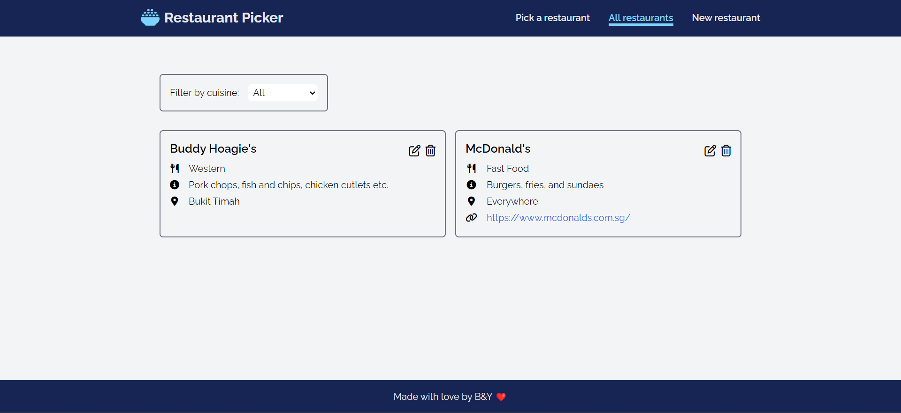

# restaurant-picker

A simple web application to help indecisive dummies (us, not you) decide what to eat.

Tech stack:

-   Frontend: React, Tailwind
-   Backend: Node.js, Express, MongoDB

The backend was deployed using [Fly.io](https://fly.io/). The frontend was deployed using [Vercel](https://vercel.com/).

## Preview

## Demo

View the demo on Vercel [here](https://restaurant-picker-chi.vercel.app/)!
